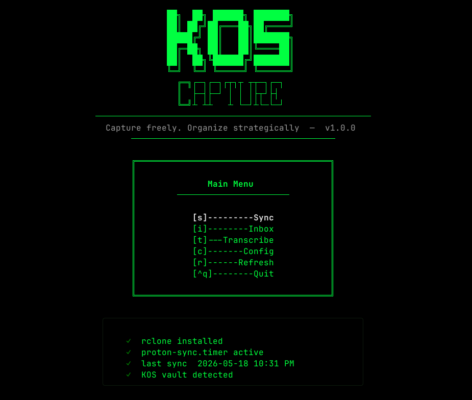

# KOS Capture

<div style="display: flex; gap: 10px;">


</div></br>

> A TUI capture pipeline for [Kodex OS](https://github.com/k0d3x8its/kodex-os) — wraps Field Notes scanning, file naming, and audio/video transcription into a single keyboard-driven interface. Built with Textual.

Part of [Kodex OS](https://github.com/k0d3x8its/kodex-os) — a layered personal knowledge management system.

---

<p align="center">
  
</p>

---

## What It Does

Getting raw material into a [KOS](https://github.com/k0d3x8its/kos) vault normally means multiple terminal touchpoints: checking rclone sync, renaming PDFs with the right suffix, routing files to the correct collection and volume, and running `/kos-ingest` in your agent. KOS Capture wraps all of that into one keyboard-driven TUI — no raw terminal required.

It handles two pipelines:

**Scan pipeline** — Field Notes pages scanned via Proton Drive → named, routed to the correct `raw/` directory, ready for ingest.

**Transcription pipeline** — Proton Meet recordings, YouTube URLs, and podcast feeds → transcribed locally via `faster-whisper` → timestamped `.md` files dropped into `raw/transcripts/`. Nothing leaves your machine.

When files are in place, KOS Capture tells you exactly what was moved and which paths to hand to `/kos-ingest` in your agent.

---

## Where KOS Capture Fits

KOS Capture sits upstream of KOS. It does not own the wiki — it owns the pipeline that gets raw material into `raw/` so KOS can process it.

```
Layer 0: Field Notes (physical capture)
        ↓
  kos-capture          ← this repo
  (scan + transcribe → raw/)
        ↓
  KOS /kos-ingest
  (raw/ → wiki/)
        ↓
Layer 1: KOS vault (LLM-maintained wiki)
        ↓
Layer 2: Notion (project intelligence)
```

KOS Capture has no knowledge of `wiki/`. It reads `raw/` to detect existing volumes and writes to `raw/` when moving or dropping files. That's the boundary.

---

## Prerequisites

KOS Capture assumes the following are already in place before first run:

- **Python 3.10+**
- **[rclone](https://rclone.org) ≥ 1.63** — configured with a Proton Drive remote and a systemd sync timer. See [references/CAPTURE.md](https://github.com/k0d3x8its/kos/blob/main/references/CAPTURE.md) in the KOS repo for the full setup walkthrough.
- **[ffmpeg](https://ffmpeg.org)** — required for MP4 audio extraction (system dependency, not pip)
- **A KOS vault** — set up via `/kos` in your AI agent. KOS Capture reads from and writes to the vault's `raw/` directory.

> KOS Capture does **not** configure rclone for you. The rclone setup requires interactive browser auth that cannot be wrapped in a TUI. Run `rclone config` once — it's a one-time setup. Do not install rclone via `apt` — the Ubuntu repos ship an outdated version. Use the [official install script](https://rclone.org/install.sh).

**Install ffmpeg:**

```bash
# macOS
brew install ffmpeg

# Ubuntu / Debian
sudo apt install ffmpeg
```

---

## Install

**1. Clone the repo:**

```bash
git clone https://github.com/k0d3x8its/kos-capture.git
cd kos-capture
```

**2. Create and activate a virtual environment:**

```bash
python -m venv .venv
source .venv/bin/activate      # macOS / Linux
# or
.venv\Scripts\activate         # Windows
```

**3. Install dependencies:**

```bash
pip install -r requirements.txt
```

> **`yt-dlp` is optional.** It is only required for URL-based sources — YouTube (always) and Podcast when the input is an http/https URL. Proton Meet recordings and local podcast files go directly to faster-whisper with no download step. If you only use local files, you can skip it:
> ```bash
> pip install textual pyfiglet tomli faster-whisper
> ```

> **Python 3.11+ users:** `tomllib` is included in the standard library — you do not need to install `tomli`. It is listed in `requirements.txt` for compatibility with Python 3.10. On 3.11+ it installs harmlessly but is never used.

---

## Run

Make sure your virtual environment is active, then:

```bash
python main.py
```

**First launch:** KOS Capture checks for `~/.config/kos-capture/config.toml`. If it doesn't exist, you'll be routed to the setup screen automatically to configure your paths.

**Subsequent launches:** Opens directly to the Home screen. Use the Config screen at any time to update your Proton Drive path or vault root.

---

## Setup Screen

On first run, you'll be prompted for three fields:

| Field | What to enter |
|---|---|
| Proton Drive local path | The local directory where rclone syncs your Field Notes scans |
| KOS vault root | The root directory of your KOS vault |
| Proton Drive remote path | The subfolder on Proton Drive to scope syncs (e.g. `Photos/Field-Notes`) |

All fields are validated before being written to `~/.config/kos-capture/config.toml`. Everything else is derived from them.

```toml
[paths]
proton_drive = "<your Proton Drive local sync folder>"
vault_root   = "<your KOS vault root>"
remote_path  = "<your Proton Drive subfolder>"
```

---

## Screens

| Screen | What it does |
|---|---|
| **Home** | ASCII splash + system status (rclone installed, timer running, vault detected) |
| **Config** | Update Proton Drive path and vault root at any time |
| **Sync** | Shows last rclone sync time and systemd timer status; trigger a manual sync |
| **Inbox** | Lists PDFs detected in your Proton Drive sync folder awaiting processing |
| **Naming Wizard** | Per-file: choose suffix (`-sticky` / `-under` / `-flip` / bare), select collection and volume, confirm move |
| **Transcribe** | Choose source type — Proton Meet (local file), YouTube (URL), or Podcast (URL or local file) — then run transcription |
| **Ready** | Lists all files moved or transcribed this session, grouped by category (Field Logs, Field Research, Field Studies, Meetings, YouTube, Podcasts); prompts you to run `/kos-ingest` in your agent |

---

## Scan Pipeline

```
Proton Drive app (phone) → PDF uploaded to Proton Drive
        ↓
rclone syncs to local machine (every 5 min via systemd timer)
        ↓
KOS Capture detects new PDFs in Inbox
        ↓
Naming Wizard → apply suffix, select collection + volume, confirm
        ↓
File moved to raw/<collection>/<volume>/
        ↓
✅ Ready screen — run /kos-ingest in your agent
```

### Suffix convention

| Suffix | When to use |
|---|---|
| (none) | Bare page — no stickies |
| `-sticky` | Sticky note on top — scan shows sticky front + visible page text |
| `-under` | Sticky peeled back — reveals page text beneath it |
| `-flip` | Back of the sticky only — captured while peeled back |

See [references/CAPTURE.md](https://github.com/k0d3x8its/kos/blob/main/references/CAPTURE.md) for the full scanning workflow and filename convention.

### Collection routing

```
Field-Logs      → raw/Field-Logs/FL-vol-XXX/
Field-Research  → raw/Field-Research/FR-vol-XXX/
Field-Studies   → raw/Field-Studies/FS-vol-XXX/
```

Volumes are auto-detected from your vault. You can create a new volume directory from within the wizard.

---

## Transcription Pipeline

```
Source:
  Proton Meet → local file (MP4, MP3, WAV, M4A, any ffmpeg format)
  YouTube     → URL → yt-dlp downloads audio              (requires yt-dlp)
  Podcast     → URL → yt-dlp downloads audio              (requires yt-dlp)
              → local file → faster-whisper directly      (no yt-dlp needed)
        ↓
faster-whisper transcribes locally (CPU, int8 — no GPU required)
        ↓
.md file with [MM:SS] timestamps per segment
        ↓
Dropped into:
  raw/transcripts/meetings/    ← Proton Meet
  raw/transcripts/youtube/     ← YouTube
  raw/transcripts/podcasts/    ← Podcasts
        ↓
✅ Ready screen — run /kos-ingest in your agent
```

Transcript filenames: `<title>-YYYY-MM-DD.md`. Title is auto-derived from the filename stem (local files) or the video/episode title returned by yt-dlp (URLs), or overridden via the optional Title field in the Transcribe screen.

All transcription runs locally. No audio or transcript data is sent to any external service.

---

## After KOS Capture

KOS Capture gets files into the right place. Processing them into your wiki is a separate step — open your AI agent, navigate to your vault, and run:

```
/kos-ingest
```

The LLM reads the files, extracts structure, and builds wiki pages per your `SCHEMA.md`. See the [KOS repo](https://github.com/k0d3x8its/kos) for full documentation.

> **Why can't KOS Capture run `/kos-ingest` directly?** `/kos-ingest` is an Agent Skill — it runs inside an LLM agent (Claude Code, Codex, Cursor, Gemini CLI). There is no standalone CLI for Agent Skills that KOS Capture can call. Ingest automation is a v2 backlog item pending Agent Skills CLI support.

---

## Repo Structure

```
kos-capture/
├── main.py                  # Entry point — launches the Textual app
├── app.py                   # Textual App class, screen registration, keybindings
├── screens/
│   ├── home.py              # ASCII splash + system status
│   ├── setup.py             # First-run config — prompts for both paths, writes config.toml
│   ├── sync.py              # Rclone status, last sync time, manual trigger
│   ├── inbox.py             # Lists PDFs awaiting processing
│   ├── wizard.py            # Naming wizard — suffix, collection, volume, move
│   ├── transcribe.py        # Source type selector, runs transcription
│   └── ready.py             # Lists moved/transcribed files, prompts for /kos-ingest
├── core/
│   ├── config.py            # Read/write ~/.config/kos-capture/config.toml
│   ├── rclone.py            # Rclone subprocess wrapper + systemd timer check
│   ├── vault.py             # Vault path helpers — detect volumes, create dirs
│   └── transcribe.py        # faster-whisper + yt-dlp wrapper; [MM:SS] timestamped .md output
├── requirements.txt
├── README.md
└── LICENSE
```

---

## Dependencies

**Python packages (`requirements.txt`):**

```
textual
pyfiglet
tomli            # Python 3.10 only — stdlib tomllib used on 3.11+
faster-whisper
yt-dlp           # optional — YouTube and Podcast transcription only
```

**System dependencies (not pip):**

| Tool | Version | Purpose |
|---|---|---|
| `ffmpeg` | any recent | Audio extraction from MP4 |
| `rclone` | ≥ 1.63 | Proton Drive sync — must be configured before first run |

---

## License

Apache 2.0 — same as [Kodex OS](https://github.com/k0d3x8its/kodex-os).

---

Part of [Kodex OS](https://github.com/k0d3x8its/kodex-os) — a layered personal knowledge management system.
